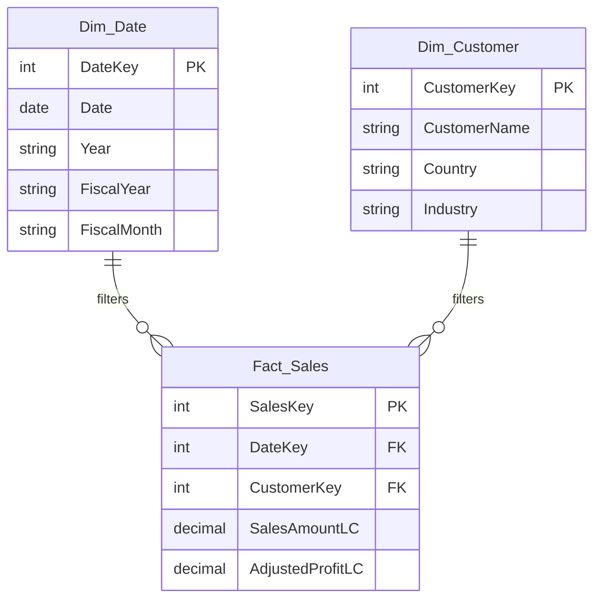

# Skill: Logical Data Model Design (Kimball Methodology)

## Prerequisites
- Reference `.github/references/relationship-patterns.md` for advanced relationship patterns.
- Reference `.github/references/naming-conventions.md` for naming rules.
- If (and ONLY if) RLS is required by the specs, reference `.github/references/security-rls-best-practices.md` for recommended patterns (dynamic RLS, least privilege, governance).

## Step Scope & I/O Gate Alignment (MANDATORY)

- This skill is step-scoped: execute it only for **Step 02**. Do NOT preload downstream skills unless explicitly required by a blocking dependency.
- Input gate: verify Step 01 artifact exists and is readable before modeling.
- Output gate: before completion, verify `<ProjectName>/spec/er_diagram.md` exists, is non-empty, and is recorded in `workflow_state.json`.

## Design Rules

When designing the logical data model, strictly adhere to Kimball dimensional modeling principles:

### Star Schema
- Design a **pure Star Schema**. Avoid Snowflaking unless explicitly requested by the user for a highly specific, justified reason.
- Every Fact table sits at the center, surrounded by Dimension tables.
- No direct Fact-to-Fact joins (use conformed dimensions instead — Kimball multipass SQL rule).

### Naming Conventions
- **Fact tables**: `Fact_<BusinessProcess>` (e.g., `Fact_Sales`, `Fact_Budget`)
- **Dimension tables**: `Dim_<Entity>` (e.g., `Dim_Customer`, `Dim_Date`, `Dim_Area`)
- **Measures table**: `_Measures` (disconnected, prefixed with underscore)
- See `.github/references/naming-conventions.md` for full column-level naming rules.

### Surrogate Keys
- ALL dimensions MUST use **integer-based Surrogate Keys** (e.g., `DateKey`, `CustomerKey`) as their Primary Key.
- Fact tables reference dimensions via **Foreign Keys** matching the surrogate keys.
- **Never use natural business keys** for relationships (store them as descriptive attributes).
- Exception: `Dim_Date` may use `DateKey` in `YYYYMMDD` integer format for readability.

### Conformed Dimensions
- Dimensions shared across multiple fact tables MUST be **conformed**: identical attributes and domain values.
- Budget and Sales facts sharing Area and Date dimensions must use the SAME dimension tables.

### Slowly Changing Dimensions (SCD)
- If historical tracking is implied in the specifications, default to **SCD Type 2** for those dimensions.
- SCD Type 2 requires: `ValidFrom` (date), `ValidTo` (date), `IsCurrent` (boolean) columns.
- If not implied, use **SCD Type 1** (overwrite) as default.

### Date Dimension
- ALWAYS include a `Dim_Date` table (calendar dimension).
- It MUST be marked as the **Date Table** in the semantic model.
- Include fiscal year/month columns if the specs reference fiscal periods.
- Include: `DateKey`, `Date`, `Year`, `Quarter`, `Month`, `MonthName`, `DayOfWeek`, `DayName`, `IsWeekend`, `FiscalYear`, `FiscalMonth`, `FiscalQuarter`.

### Degenerate Dimensions
- Transaction identifiers (e.g., `SalesID`, `InvoiceNumber`) that don't warrant a separate dimension table should be kept directly in the Fact table as **degenerate dimensions**.

### Security & RLS Modeling (if applicable)
- If requirements include **dynamic RLS**, plan the required security mapping entities in the logical model (e.g., `Dim_UserSecurity`, `Bridge_UserTerritory`, `Bridge_UserCustomer`).
- Prefer modeling RLS filters on **Dimensions** (with relationship propagation to Facts) rather than filtering Facts directly.
- Keep security entities consistent with the overall star design (avoid introducing ambiguous paths or many-to-many unless explicitly required).

### ⛔ CRITICAL: Ambiguous Path Detection

**Ambiguous paths** occur when there are MULTIPLE active relationship paths between the same two tables. This causes Power BI to fail with error:
```
There are ambiguous paths between '<FactTable>' and '<DimensionTable>': 
'<FactTable>'->'<IntermediateDim>'->'<DimensionTable>' and '<FactTable>'->'<DimensionTable>'
```

**Common Cause**: Redundant Foreign Keys in Fact tables that create both direct and indirect paths.

**Example of INCORRECT design** (creates ambiguity):
- `Fact_Sales` has FK: `CustomerKey`, `CountryKey`, `AreaKey`, `IndustryKey`
- `Dim_Customer` has FK: `CountryKey`, `IndustryKey`
- `Dim_Country` has FK: `AreaKey`

This creates THREE ambiguous paths:
1. `Fact_Sales → Dim_Country` (direct) vs `Fact_Sales → Dim_Customer → Dim_Country` (indirect)
2. `Fact_Sales → Dim_Area` (direct) vs `Fact_Sales → Dim_Customer → Dim_Country → Dim_Area` (indirect)
3. `Fact_Sales → Dim_Industry` (direct) vs `Fact_Sales → Dim_Customer → Dim_Industry` (indirect)

**CORRECT Design Rules**:
1. **Remove redundant FKs**: If a dimension is reachable through another dimension, do NOT create a direct FK in the fact table
2. **Choose ONE path**: Either direct FK OR through intermediate dimension, NEVER both
3. **Snowflake when necessary**: For normalized hierarchies (Customer → Country → Area), keep only the Customer FK in the fact

**Corrected Example**:
- `Fact_Sales` has FK: `CustomerKey`, `ProductKey`, `DateKey`, `SalespersonKey` ONLY
- `Dim_Customer` has FK: `CountryKey`, `IndustryKey`
- `Dim_Country` has FK: `AreaKey`
- Paths are now unambiguous: `Fact_Sales → Dim_Customer → Dim_Country → Dim_Area`

**When to Use Inactive Relationships**: If you genuinely need multiple paths (e.g., role-playing dimensions like OrderDate/ShipDate), make all but ONE relationship `isActive: false` and use `USERELATIONSHIP()` in DAX.

## Output Format

Output the proposed logical model using **Mermaid.js Entity-Relationship diagram** syntax:



### Checklist Before Presenting
- [ ] All fact tables have a clear grain documented
- [ ] All dimensions use integer surrogate keys
- [ ] `Dim_Date` is included with fiscal period columns
- [ ] All relationships are 1:N (Dim to Fact)
- [ ] Conformed dimensions are identified
- [ ] Naming follows conventions
- [ ] **NO ambiguous paths**: Verify that between any two tables there is ONLY ONE active relationship path (no redundant FKs in fact tables)
- [ ] If snowflaking is used, ensure fact tables connect only to the lowest-grain dimension in the hierarchy

## Artifact Checkpointing (MANDATORY)

**BEFORE presenting results to the user**, the agent MUST:

1. **SAVE** the ER diagram and model design to disk as `<ProjectName>/spec/er_diagram.md`.
   - The file must contain the full Mermaid.js ER diagram code block.
   - Include the grain definitions for each fact table.
   - Include the checklist results.
   - Include any design decisions and rationale.
2. **UPDATE** `<ProjectName>/workflow_state.json`:
   - Set `pendingStep` to Step 02 completed.
   - Add artifact path `<ProjectName>/spec/er_diagram.md`.
3. **CONFIRM** to the user that the artifact file has been saved.

## Context Flushing Rule

When starting this step, the agent MUST:
- **READ** `<ProjectName>/workflow_state.json` to verify Step 01 is completed.
- **READ** `<ProjectName>/spec/requirements_summary.md` from disk (Step 01 artifact).
- **DO NOT** rely on chat history for requirements data.

**STOP here. Present the ER diagram and await user validation before proceeding to Step 3.**