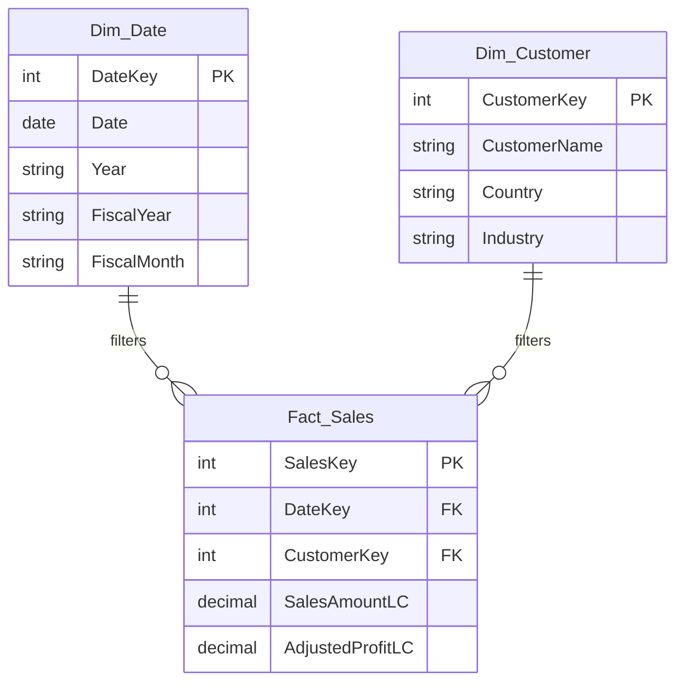

# Skill: Logical Data Model Design (Kimball Methodology)

## Prerequisites
- Read `PBIP/kimball.md` reference for Kimball methodology principles.
- Reference `.github/references/naming-conventions.md` for naming rules.

## Design Rules

When designing the logical data model, strictly adhere to Kimball dimensional modeling principles:

### Star Schema
- Design a **pure Star Schema**. Avoid Snowflaking unless explicitly requested by the user for a highly specific, justified reason.
- Every Fact table sits at the center, surrounded by Dimension tables.
- No direct Fact-to-Fact joins (use conformed dimensions instead — Kimball multipass SQL rule).

### Naming Conventions
- **Fact tables**: `Fact_<BusinessProcess>` (e.g., `Fact_Sales`, `Fact_Budget`)
- **Dimension tables**: `Dim_<Entity>` (e.g., `Dim_Customer`, `Dim_Date`, `Dim_Area`)
- **Measures table**: `_Measures` (disconnected, prefixed with underscore)
- See `.github/references/naming-conventions.md` for full column-level naming rules.

### Surrogate Keys
- ALL dimensions MUST use **integer-based Surrogate Keys** (e.g., `DateKey`, `CustomerKey`) as their Primary Key.
- Fact tables reference dimensions via **Foreign Keys** matching the surrogate keys.
- **Never use natural business keys** for relationships (store them as descriptive attributes).
- Exception: `Dim_Date` may use `DateKey` in `YYYYMMDD` integer format for readability.

### Conformed Dimensions
- Dimensions shared across multiple fact tables MUST be **conformed**: identical attributes and domain values.
- Budget and Sales facts sharing Area and Date dimensions must use the SAME dimension tables.

### Slowly Changing Dimensions (SCD)
- If historical tracking is implied in the specifications, default to **SCD Type 2** for those dimensions.
- SCD Type 2 requires: `ValidFrom` (date), `ValidTo` (date), `IsCurrent` (boolean) columns.
- If not implied, use **SCD Type 1** (overwrite) as default.

### Date Dimension
- ALWAYS include a `Dim_Date` table (calendar dimension).
- It MUST be marked as the **Date Table** in the semantic model.
- Include fiscal year/month columns if the specs reference fiscal periods.
- Include: `DateKey`, `Date`, `Year`, `Quarter`, `Month`, `MonthName`, `DayOfWeek`, `DayName`, `IsWeekend`, `FiscalYear`, `FiscalMonth`, `FiscalQuarter`.

### Degenerate Dimensions
- Transaction identifiers (e.g., `SalesID`, `InvoiceNumber`) that don't warrant a separate dimension table should be kept directly in the Fact table as **degenerate dimensions**.

## Output Format

Output the proposed logical model using **Mermaid.js Entity-Relationship diagram** syntax:

### Checklist Before Presenting
- [ ] All fact tables have a clear grain documented
- [ ] All dimensions use integer surrogate keys
- [ ] `Dim_Date` is included with fiscal period columns
- [ ] All relationships are 1:N (Dim to Fact)
- [ ] Conformed dimensions are identified
- [ ] Naming follows conventions

**STOP here. Present the ER diagram and await user validation before proceeding to Step 3.**