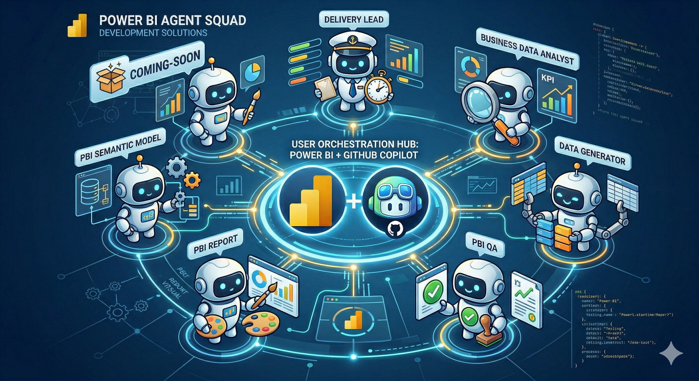

# Agentic Power BI Squad

> **Build complete Power BI projects — semantic models (TMDL) and reports (PBIR) — from functional specifications using a multi-agent system powered by GitHub Copilot.**

[](https://powerbi.microsoft.com)
[](https://www.python.org/)

---

## What Is This?

**Agentic Power BI Squad** is a **multi-agent system** for Power BI development that runs inside VS Code with GitHub Copilot. Instead of a single monolithic agent, it uses a team of **6 domain-specific agents** coordinated by an orchestrator, each backed by **15 modular skills** containing procedural knowledge, reference materials, and examples.



You provide a functional specification in Markdown. The squad produces:

- **Dimensional data model** (Kimball Star Schema) with TMDL files
- **Optimized DAX measures** (time intelligence, KPIs, variances)
- **Mock CSV datasets** for local development
- **Automated functional tests** with pass/fail reports
- **Report blueprint** (design system, page layouts, visual specs)
- **PBIR report files** (pages, visuals, slicers) ready for Power BI Desktop
- **Custom visuals** via SVG inline graphics and Deneb (Vega/Vega-Lite)
- **Report themes** with full formatting hierarchy
- **Quality validation** at every step

The output is a complete **PBIP project** that opens directly in Power BI Desktop.

### Two Ways to Work

The squad supports **two operating modes**:

| Mode | How it works | When to use |
|---|---|---|
| **Workflow Mode** | The `delivery-lead` orchestrator coordinates all 6 agents through a structured 10-step pipeline with approval gates at each phase | Building a complete project from a specification end-to-end |
| **Standalone Mode** | Invoke any agent directly (e.g., `@pbi-semantic-model`, `@pbi-report`, `@pbi-qa`) for a specific task | Adding a measure, creating a visual, running tests, or any targeted change |

Both modes share the same agents, skills, and project structure — the difference is whether you want full orchestration or direct control.

### Public Repository Model

This repository is published as a **public reference implementation** with a **fork-first collaboration model**:

- use a **fork** for experimentation, adaptation, and contributions
- submit changes back through **pull requests**
- do **not** use external setup tools or generated scaffolds to overwrite the repository-native `.github/agents`, `.github/skills`, `.github/prompts`, or instruction files
- review [LICENSE](LICENSE), [CONTRIBUTING.md](CONTRIBUTING.md), and [THIRD_PARTY_NOTICES.md](THIRD_PARTY_NOTICES.md) before reusing adapted material outside your fork

---

## Architecture

### Agents Squad

| Agent | Domain | Description |
|---|---|---|
| `delivery-lead` | Orchestration | End-to-end workflow management, phase transitions, user approvals |
| `business-data-analyst` | Requirements | Analyzes specs, extracts KPIs, dimensions, grain, constraints |
| `pbi-semantic-model` | Semantic Model | Designs logical models, writes TMDL, develops DAX measures |
| `data-generator` | Mock Data | Generates realistic CSV datasets from model schema |
| `pbi-report` | Report Design & Implementation | Designs layouts, generates PBIR visuals, SVG graphics, Deneb charts, themes |
| `pbi-qa` | Quality Assurance | Validates models (BPA), runs tests, reviews reports, checks SVG/Deneb/design quality |

### Skills (15)

Skills are self-contained knowledge packages consumed by agents. Each skill has procedural instructions (`SKILL.md`), reference files, and examples.

| Skill | Agent(s) | Purpose |
|---|---|---|
| `requirements-analysis` | business-data-analyst | Extract KPIs, dimensions, grain from specs |
| `logical-model` | pbi-semantic-model | Star schema design, ER diagrams |
| `physical-model-tmdl` | pbi-semantic-model | Generate TMDL files from logical model |
| `dax-development` | pbi-semantic-model | DAX measure authoring with patterns and pitfalls |
| `mock-data-generation` | data-generator | CSV dataset generation with referential integrity |
| `report-design` | pbi-report | Layout, storytelling, chart selection, design system |
| `report-implementation` | pbi-report | PBIR JSON generation from blueprint |
| `svg-visuals` | pbi-report | Inline SVG graphics via DAX (sparklines, bars, KPI indicators) |
| `deneb-visuals` | pbi-report | Vega/Vega-Lite custom charts with PBIR integration |
| `theme-customization` | pbi-report | Theme authoring, formatting hierarchy, visual-type overrides |
| `code-review` | pbi-qa | TMDL quality, BPA compliance, naming conventions |
| `functional-testing` | pbi-qa | Automated DAX measure testing against expected values |
| `report-quality-validation` | pbi-qa | PBIR validation, SVG/Deneb review, design quality checks |
| `project-initialization` | delivery-lead | PBIP project scaffolding |
| `workflow-orchestration` | delivery-lead | Phase management, state tracking, decision ledger |

### Shared References

Cross-cutting references in `.github/references/`:
- `naming-conventions.md` — naming standards for all objects
- `pbip-folder-structure.md` — PBIP workspace folder layout
- `security-rls-best-practices.md` — Row-level security patterns

---

## How to Use

### Prerequisites

- **VS Code** with **GitHub Copilot** (Chat + Agents enabled)
- **Power BI Desktop** (December 2025+ for PBIR support)
- **Python 3.10+** (for mock data generation and test execution)

```bash
pip install -r requirements.txt
```

### Two Operating Modes

#### 1. Workflow Mode (Full Project)

Use the `delivery-lead` agent to build a complete project from a specification.

```
@delivery-lead Build a Power BI project from spec/sample_spec.md
```

The orchestrator coordinates all agents through a 10-step workflow:

| Step | Agent | Action |
|---|---|---|
| 00 | delivery-lead | Bootstrap PBIP project structure |
| 01 | business-data-analyst | Analyze specification, extract requirements |
| 02 | pbi-semantic-model | Design logical model (star schema, ER diagram) |
| 03 | pbi-semantic-model | Generate TMDL physical model |
| 04 | pbi-semantic-model | Develop DAX measures |
| 05 | data-generator | Generate mock CSV datasets |
| 06 | pbi-qa | Code review + BPA compliance |
| 07 | pbi-qa | Run functional tests |
| 08 | pbi-report | Design report blueprint |
| 09 | pbi-report | Implement PBIR visuals |
| 10 | pbi-qa | Validate report quality |

Each step has **mandatory approval gates** — the orchestrator presents results and waits for your approval before proceeding.

#### 2. Standalone Mode (Individual Tasks)

Invoke any agent directly for specific tasks:

```
@pbi-semantic-model Add a YTD measure for Sales Amount to the SalesOverview project

@pbi-report Add a clustered bar chart showing Sales by Area to Page 1

@pbi-report Create a Deneb heatmap for monthly sales by region

@pbi-report Create an SVG sparkline measure for revenue trend

@pbi-report Create a custom theme with blue/orange palette and enterprise formatting

@pbi-qa Validate the PBIR report structure for SalesOverview

@pbi-qa Review SVG measures for correctness

@data-generator Generate mock data for the SalesOverview semantic model
```

Each agent automatically discovers the project context (TMDL files, existing visuals, blueprint) before acting.

---

## Project Structure

```
<ProjectName>/
├── spec/                          # Specifications and blueprints
│   ├── spec_<name>.md             # Functional specification (input)
│   ├── requirements_summary.md    # Extracted requirements
│   ├── er_diagram.md              # Logical model diagram
│   └── report_blueprint.json      # Report design blueprint
├── data/                          # Mock CSV datasets
├── PBIP/                          # Power BI Project (PBIP format)
│   ├── <Name>.pbip                # Project entry point
│   ├── <Name>.SemanticModel/
│   │   └── definition/
│   │       ├── model.tmdl
│   │       ├── relationships.tmdl
│   │       ├── expressions.tmdl
│   │       └── tables/            # One .tmdl per table
│   └── <Name>.Report/
│       └── definition/
│           ├── report.json
│           ├── reportExtensions.json  # Extension measures
│           ├── pages/
│           │   ├── pages.json
│           │   └── <pageId>/
│           │       ├── page.json
│           │       └── visuals/
│           │           └── <visualId>/
│           │               └── visual.json
│           └── StaticResources/
│               └── SharedResources/
│                   └── BaseThemes/    # Report themes
├── tests/                         # Test definitions and results
├── scripts/                       # Data generation scripts
└── workflow_state.json            # Orchestrator state (workflow mode)
```

---

## Getting Started

1. **Fork the repository** on GitHub.

2. **Clone your fork**:
   ```bash
   git clone <your-fork-url>
   cd agentic-powerbi-development
   ```

3. **Install Python dependencies**:
   ```bash
   pip install -r requirements.txt
   ```

4. **Open in VS Code** with GitHub Copilot enabled.

5. **Start with a specification** — use `spec/specification_template.md` as the template and `spec/sample_spec.md` as a worked example.

6. **Choose your mode**:
   - **Full project**: `@delivery-lead Build from spec/sample_spec.md`
   - **Single task**: `@pbi-semantic-model Create a logical model for <requirements>`

7. **Open the result** in Power BI Desktop: open the `.pbip` file from the `PBIP/` folder.

---

## Reference Assets

The repository includes a reusable template project structure and a sample specification. It does **not** ship a committed full PBIP sample project with generated outputs. Use these assets as the starting point:

- `[ProjectName]/` for expected project folder layout
- `spec/specification_template.md` for the empty specification template
- `spec/sample_spec.md` for a completed example specification

Generated semantic model, report, data, and test artifacts are created when you run the workflow or the specialist agents against your own project folder.

---

## Attribution

This repository includes original material plus adapted domain knowledge derived from the **[Goblin Power BI Agentic Development](https://github.com/data-goblins)** project by Data Goblins. The most relevant adapted areas are documented in [THIRD_PARTY_NOTICES.md](THIRD_PARTY_NOTICES.md).

If you reuse or adapt material influenced by that project, preserve attribution and review the upstream reuse terms before distributing it outside a fork-based workflow.

**Original project**: [https://github.com/data-goblins](https://github.com/data-goblins)

---

## Contributing

This repository accepts changes through a **fork + pull request** flow only. See [CONTRIBUTING.md](CONTRIBUTING.md) for the contribution model and non-overwrite rules.

## Security

See [SECURITY.md](SECURITY.md) for vulnerability reporting and secret-handling guidance.

## Code of Conduct

See [CODE_OF_CONDUCT.md](CODE_OF_CONDUCT.md) for participation expectations.

## License

Repository use is governed by the fork-first terms in [LICENSE](LICENSE). Third-party attribution and additional reuse notes are documented in [THIRD_PARTY_NOTICES.md](THIRD_PARTY_NOTICES.md).
